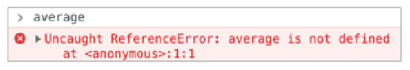

# 자바스크립트 딥다이브 개념 발표

## 01. 변수

### :one: 변수는 왜 등장했을까?

- 메모리 주소를 통해 값에 직접적으로 접근하는 것은 오류를 발생시킬 확률이 높은 행위이다. 따라서 자바스크립트는 개발자가 직접적으로 메모리를 제어하는것을 허용하지 않는다.

- 값이 저장될 메모리의 주소는 코드가 실행될 때의 메모리 상태에 따라 임의로 정해진다. 그러므로 동일한 컴퓨터의 동일한 코드를 실행한다고 하더라도 코드가 실행될 때마다 값이 저장될 메모리 주소는 변경된다. 이와 같이 코드가 실행되기 전에는 값이 저장된 메모리 주소를 알기가 어렵다. 따라서 메모리에 직접적으로 접근하는 것은 올바른 행위가 아니다.

- 이러한 문제점에 대한 완충작용으로서 프로그래밍 언어는 `변수`를 제공한다. 변수는 기억하고 싶은 값을 메모리에 저장하고 저장된 값을 읽어 들여서 재사용할 수 있게 만들어준다.

<br>

### :two: 그래서 변수가 뭔데?

- `변수`

  - 하나의 값을 저장하기 위해 확보한 메모리 공간
  - [프로그래밍 언어상] 하나의 값을 저장하고 참조하는 메커니즘 (배열/객체를 사용하면 관련된 여러개의 값을 그룹화해서 하나의 값처럼 사용할 수 있음)

  ```js
  /* 변수에는 하나의 값만 저장가능 */
  var userId = "danny0125";
  var userName = "kim";

  /* 배열/객체를 사용해서 여러 개의 값을 그룹화해서 하나의 값처럼 사용할 수 있음 */
  var userInfo = { id: "danny0125", name: "kim" };
  var usersInfo = { id: "danny0125", name: "kim" }, {id: "daniel", name:"lee"};
  ```

<br>

- `변수명`

  - 메모리 공간에 저장된 값을 식별할 수 있는 고유한 이름
  - 해당 메모리 공간을 식별하기 위해 붙인 이름
  - 값의 위치를 가리키는 상징적인 명칭

<br>

- `변수값`

  - 변수에 저장된 값

<br>

- `할당 (assignment)`

  - 변수에 값을 저장하는 것
  - 자바스크립트는 런타임 이전에 선언이 되고, 런타임시 할당이 된다.

<br>

- `참조 (reference)`

  - 변수에 저장된 값을 읽어 들이는 것
  - 변수명을 이용하여 참조 요청시 자바스크립트 엔진은 변수명과 매핑된(짝이 지어진) 메모리 주소를 통해 메모리 공간에 접근해서 저장된 값을 반환함

    ```js
    var result = 10 + 20;
    result; // 30. 변수명을 이용한 참조 -> 메모리 상에 저장된 값을 반환
    ```

<br>

### :three: 변수의 작동원리

- 변수는 프로그래밍 언어의 컴파일러(또는 인터프리터)에 의해 값이 저장된 메모리 공간의 주소로 치환되어 실행된다.
- 따라서 개발자가 직접 메모리 주소를 통해 값을 저장하고 참조할 필요가 없고 변수를 통해 안전하게 값에 접근할 수 있다.

<br>

### :four: 식별자 (identifier)

#### 식별자란?

- 어떤 값을 구별하여 식별할 수 있는 고유한 변수명을 뜻함
- 코드 내의 변수/함수/속성 등을 구별하는 문자열임
- 메모리 상에 존재하는 어떤 값을 식별할 수 있는 모든 이름을 `식별자`라고 함

  - ex) 변수, 함수, 클래스

<br>

#### 식별자의 특징

- 값은 메모리 공간에 저장되어 있다. 따라서 식별자는 메모리 공간에 저장되어 있는 어떤 값을 구별해서 식별해 낼 수 있어야 한다. 이를 위해 식별자는 어떤 값이 저장되어 있는 메모리 주소를 기억(저장)해야 한다. (식별자는 값을 저장하는것이 아니다 !)

- 식별자는 값이 저장되어 있는 메모리 주소와 매핑 관계를 맺으며, 이 매핑정보는 메모리에 저장되어야 한다.

- 식별자로 값을 구분해서 식별하겠다는 것은 식별자가 기억하고 있는 메모리 주소를 통해 메모리 공간에 저장된 값에 접근할 수 있다는 의미이다.

- 즉, 식별자는 메모리 주소에 붙인 이름이라고 할 수 있다.<br>
  

- 식별자인 변수명으로는 메모리상에 존재하는 변수 값을 식별할 수 있고, 함수명으로는 메모리상에 존재하는 함수(자바스크립트에서 함수는 값임)를 식별할 수 있다

### :five: 변수 선언

- 변수, 함수, 클래스 등의 이름과 같은 식별자는 네이밍 규칙을 준수해야 하며, 선언에 의해 자바스크립트 엔진에 식별자의 존재를 알린다.

#### 변수 선언이란?

- 포괄적인 의미

  - 변수를 생성하는 것

- 세부적인 의미

  - 값을 저장하기 위한 메모리 공간을 확보하고 변수명과 확보된 메모리 공간의 주소를 연결(name binding)해서 값을 저장할 수 있게 준비하는 과정

- 변수 선언에 의해 확보된 공간은 확보가 해제(release)되기 전까지는 누구도 확보된 메모리 공간을 사용할 수 없도록 보호되므로 안전하게 사용할 수 있음

- 변수를 사용하기 위해서는 반드시 선언이 필요하며, 선언하지 않은 식별자에 접근하면 `ReferenceError(참조 에러)`가 발생한다.

- ReferenceError<br>
  <br>
  - 식별자를 통해 값을 참조하려 했으나 자바스크립트 엔진이 등록된 식별자를 찾을 수 없을 경우 발생하는 에러

##### var

- 변수를 선언할 때 사용하는 키워드이며 변수(`var`iable)의 앞 세글자를 따온 것이다.

- ES6(ES5에 일부 기능을 추가한 상위 집합)에서 let, const 키워드가 도입되기 전까지 자바스크립트상 변수를 선언할 수 있게 해주는 유일한 키워드

- `var` 뒤에 오는 변수의 이름으로 새로운 변수를 선언할 것임을 지시함

```js
var score; // 변수 선언
```


<br>

- 위 예시를 통해 var 키워드를 이용해서 변수를 선언하면 score이라는 변수명이 등록되고, 해당 변수값이 저장될 메모리 공간을 확보하는 것을 확인할 수 있다.
- 하지만 이 코드는 변수선언만 하였고 변수에 값을 할당하지는 않았다.
- 변수 선언을 통해 확보된 메모리 공간이 비어있다고 생각할 수 있나, 해당 메모리 공간에는 `undefined`값이 암묵적으로 할당되어 있다. (이는 자바스크립트 엔진에 의해 이루어지는 암묵적인 초기화 과정이다)

- undefined

  - 자바스크립트에서 제공하는 원시 타입의 값(primitive value)

###### 자바스크립트의 변수 선언

1. 선언 단계<br>
   변수명을 등록해서 자바스크립트 엔진에 변수의 존재를 알림

2. 초기화 단계<br>
   값을 저장하기 위한 메모리 공간을 확보하고 암묵적으로 undefined라는 값을 할당해서 초기화함<br>
   초기화 단계를 거치지 않는 경우 메모리 공간상에는 이전에 다른 애플리케이션이 사용했던 값이 남아 있을 수 있는데 이를 `쓰레기 값 (garbage value)`이라 함<br>
   (값을 할당하지 않은 상태에서 곧바로 변수 값을 참조하는 경우 쓰레기값이 나올 수 있음)

<br>

- `var` 키워드를 사용해서 변수를 선언하는 경우 선언 단꼐와 초기화 단계가 동시에 이루어진다.

```js
var score;

// 선언 단계를 통해 변수명 score 등록
// 초기화 단계를 통해 score에 undefined라는 값을 암묵적으로 할당해서 초기화를 진행함
```

- `var` 키워드는 암묵적으로 초기화를 수행하므로 쓰레기값이 할당될 위험이 없다.

###### 변수명이 등록되는 장소

- 실행 컨텍스트 (자바스크립트 엔진이 소스코드를 평가하여 실행하기 위해 필요한 환경을 제공하고 코드의 실행 결과를 관리하는 영역)
- 자바스크립트 엔진은 실행 컨텍스트를 통해 식별자와 스코프를 관리함

- 선언 단계와 초기화 단계가 동시에 진행됨

###### var의 단점

- 블록 레벨 스코프를 지원하지 않고 함수 레벨 스코프를 지원함
  - 이로 인해 의도치 않게 전역 변수가 선언되어 심각한 부작용이 발생하기도 함

###### let & const 의 도입

- var의 단점을 극복하기 위함

##### let

```js
let age;
let age; // error
```

- 재선언이 불가능 (변수명을 중복해서 만드는 실수를 방지함)

##### const

```js
const gender;
const gender;  // error
```

- 재선언이 불가능 (변수명을 중복해서 만드는 실수를 방지함)

<br>

### :six: 변수 선언의 실행시점과 변수 호이스팅

```js
console.log(score); // undefined. 변수 참조
var score; // 변수 선언
```

- 변수 선언문보다 변수 참조가 우선시 일어남 (인터프리터에 의해 순차적 실행)

  - [참고자료 - 인터프리터와 컴파일러](https://wikidocs.net/132948)
  - [참고자료 - 인터프리터와 컴파일러2](https://www.youtube.com/watch?v=Dx2tSsd3aFc&ab_channel=%EC%A0%84%EB%87%8C%ED%95%B4%EC%BB%A4)

- 따라서 undefined가 출력이됨

  - `런타임 (소스코드가 한 줄씩 순차적으로 실행되는 시점)`이 아니라 그 이전 단계에서 먼저 실행되기 때문이다.

- 자바스크립트 엔진은 소스코드를 한 줄씩 순차적으로 실행하기에 앞서 먼저 소스코드의 평가 과정을 거치면서 소스코드를 실행하기 위한 준비를 한다.<br>
  이떄 소스코드 실행을 위한 준비 단계인 소스코드의 평가 과정에서 자바스크립트 엔진은 변수 선언을 포함한 모든 선언문(변수 선언문, 함수 선언문 등)을 소스코드에서 찾아내 먼저 실행한다. <br>
  그리고 소스코드의 평가 과정이 끝나면 비로소 변수 선언을 포함한 모든 선언문을 제외하고 소스코드를 한 줄씩 순차적으로 실행한다.

- 즉, 자바스크립트 엔진은 변수 선언이 소스코드의 어디에 있든 상관없이 다른 코드보다 먼저 실행한다.<br>
  따라서 변수 선언이 어디에 위치하는지와 상관없이 어디서든지 변수를 참조할 수 있다.

- 만약 코드가 순차적으로 실행되는 런타임에 변수 선언이 실행된다면 `console.log(score)`실행 시점에는 아직 변수가 선언되기 이전이므로 `Reference Error`가 발생해야 하지만 `undefined`가 출력된다<br>
  이는 변수 선언(선언 단계와 초기화 단계)이 소스코드가 순차적으로 실행되는 런타임 이전 단계에서 먼저 실행된다는 증거이다.<br>
  이처럼 변수 선언문이 코드의 선두로 끌어 올려진 것처럼 동작하는 자바스크립트 고유의 특징을 `변수 호이스팅 (variable hoisting)`이라 한다.

- 변수 선언외에도 호이스팅 되는 것들

  - var, let, const, function, function\* (제너레이터 함수), class 등과 같이 키워드를 사용해서 선언하는 모든 식별자

- function\*

  ```js
  function* generator(i) {
    yield i;
    yield i + 10;
  }

  const gen = generator(10);

  console.log(gen); // generator {<suspended>}
  console.log(gen.next); // ƒ next() { [native code] }
  console.log(gen.next()); // {value: 10, done: false}
  console.log(gen.next().value); // 10
  console.log(gen.next().value); //20
  console.log(gen.next().value); // undefined
  ```

- `generator`

  - 빠져나갔다가 다시 돌아올 수 있는 함수이다. 이때 컨텍스트(변수 값)는 출입 과정에서 지정된 상태로 남아있다.
  - generator 함수는 호출되어도 즉시 실행되지 않고, 함수를 위한 `iterator` 객체가 반환된다.
  - `iterator`의 `next()` 메서드를 호출하면 Generator 함수가 실행되어 `yield`문을 만날 때까지 진행하고, 해당 표현식이 명시하는 `iterator`로부터의 반환값을 리턴함
  - 이후 `next()`메서드가 호출되면 진행이 멈췄던 위치에서부터 재실행함.
  - `next()`가 반환하는 객체는 `yield`문이 반환될 값(yielded value)을 나타내는 `value`속성과 Generator 함수 안의 모든 `yield`문의 실행 여부를 표시하는 boolean 타입의 `done`속성을 가진다.
  - `next()`를 인자값과 함께 호출하는 경우, 진행을 멈췄던 위치의 `yield`문을 `next()`메서드에서 받은 인자값으로 치환하고 그 위치에서 다시 실행하게 됨

    ```js
    function* idMaker() {
      var index = 0;
      while (index < 3) yield index++;
    }

    var gen = idMaker();

    console.log(gen.next().value); // 0
    console.log(gen.next().value); // 1
    console.log(gen.next().value); // 2
    console.log(gen.next().value); // undefined
    ```

  - [generator 참고자료](https://developer.mozilla.org/ko/docs/Web/JavaScript/Reference/Statements/function*)

  - `yield`

    ```js
    function\* func1() {
    yield 42;
    }

    function* func2() {
    yield* func1();
    }

    const iterator = func2();

    console.log(iterator.next().value); // 42
    console.log(iterator.next().value); // undefined
    ```

    - 다른 Generator 또는 iterable 객체에 yield를 위임할 때 사용함
    - `yield*`표현은 피연산자를 반복하고 반환되는 값을 산출(yield)
    - iterator(반복자)가 종료될 때 반환되는 값
    - [yield\* 참고자료](https://developer.mozilla.org/ko/docs/Web/JavaScript/Reference/Operators/yield*)

#### 호이스팅

- 스코프 내부 어디서든 변수 선언은 최상위에 선언된 것처럼 행동
- 호이스팅은 스코프 단위로 일어남

- 변수
  - let, const는 ES6에서 생김. 이전 JS버전에서는 var을 사용함
  - var와 let은 유사하므로 바꿔사용해도 크게 문제되지 않음
  - var는 한번 선언된 변수를 다시 선언할 수 있음
  - var는 선언하기 전에 사용할 수 있음
  ```js
  var name; // 1) 갑의 선언
  console.log(name); // 2) undefined
  name = "Danny"; // 3) 값의 할당
  ```
  - 3)부분의 name이 1)로 이동
    - var로 선언한 모든 변수는 코드가 실제로 이동하지는 않지만 실제로 최상단으로 끌어올려진 것처럼 동작함. 이를 `호이스팅`이라 함.
  - 콘솔은 undefined를 출력함
    - 선언은 호이스팅이 되지만, 할당은 호이스팅이 되지 않기 때문이다 (3)의 name이 1)로 끌어올려짐. 'Danny'라는 값은 그자리에 머물러있음)
  - 같은 상황에서 let은 에러가 발생함
  ```js
  console.log(name); // ReferenceError
  let name = "Danny";
  ```
  - let 또한 호이스팅이 발생한다.
  - 여기서 에러가 발생하는 이유는 TDZ(Temporal Dead Zone) 때문이다

##### Temporal Dead Zone

```js
console.log(name); // TDZ
const name = "rachael"; // 함수 선언 및 할당
console.log(name); // 사용 가능
```

- TDZ 영역에 있는 변수들은 사용할 수 없다.
- let과 const는 TDZ의 영향을 받는다 (따라서 할당하기 전에는 사용할 수 없다)<br>
  => 코드를 예측가능하게 하고, 잠재적인 버그를 줄일 수 있음

```js
let age = 20;
function printAge() {
  console.log(age);
}

printAge();
```

- 이 코드는 문제가 없다

```js
let age = 20;

function printAge() {
  // 스코프 단위 시작
  console.log(age); // TDZ
  let age = 15;
} // 스코프 단위 끝

printAge();
```

- 이 코드는 문제가 발생한다
- let 또한 호이스팅이 된다.
- 호이스팅은 스코프 단위로 일어난다.
- 호이스팅이 일어나지 않았다면 함수 밖에서 선언한 `age=20`이 정상적으로 찍혀야 함

###### 변수의 생성과정

1. 선언 단계
2. 초기화 단계 (undefined를 할당해주는 단계)
3. 할당 단계

- var

  - var는 선언과초기화가 동시에 이루어짐
  - 따라서 할당전에 호출을 하면 에러를 뿜지 않고 undefined를 출력
  - 함수 스코프

- let

  - 선언 단계와 초기화 단계가 분리되어 실행됨
  - 호이스팅되면서 선언 단계가 이루어지지만 초기화 단계는 실제 코드에 도달했을 때 이루어지므로 ReferenceError가 발생한다.
  - 블록 스코프

- const

  - 선언과 할당이 동시에 이루어져야 함 (let과 var는 선언만 해두고 나중에 할당하는 것을 허용함)
  - 블록 스코프

  ```js
  let name;
  name = 'Danny';

  var age;
  age = 20;

  const gender;
  gender = 'male';
  ```

  - name과 age는 괜찮지만 const로 선언한 gender 부분에서 에러가 발생함 (선언하면서 할당을 하지 않았기 때문임)

- 블록 스코프

  ```js
  function add() {
    // block level scope
  }
  ```

  ```js
  if() {
    // block level scope
  }
  ```

  ```js
  for (let i = 0; i < 10; i++) {
    // block level scope
  }
  ```

  - 블록 스코프는 모든 코드 블록에서 선언된 변수는 코드 블록 내에서만 유효하며 외부에서는 접근할 수 없다.

  - 코드 블록 (함수, if문, for문, while문, try~catch문 등) 내부에서 선언한 변수는 지역변수이다.

  ```js
  const age = 20;

  if (age < 15) {
    var txt = "학생";
  }

  console.log(txt); // 학생
  ```

  - 예를 들어 if문 내에서 var로 선언된 변수는 if문 밖에서도 사용할 수 있다. 하지만 let과 const는 if문 내에서만 사용할 수 있다.

- 함수 스코프

  - 반면, 함수 스코프는 함수 내에서 선언된 변수만 그 지역변수가 된다.

  ```js
  function add(n1, n2) {
    var result = n1 + n2;
  }

  add(5, 10);
  console.log(result); // ReferenceError
  ```

  - var도 함수 내에서 선언되면 함수 밖에서 사용할 수 없다. 유일하게 벗어날 수 없는 scope가 함수 스코프이다.

- var는 사용하지말고 let&const를 사용하는게 좋다.
  - 예측 가능한 결과를 내고, 버그를 줄일 수 있다.

<br>

### 7️⃣ 값의 할당

```js
var score; //  변수 선언
score = 100; // 값의 할당

var score = 90; // 변수 선언과 값의 할당
```

- 자바스크립트 엔진은 변수 선언과 값의 할당을 하나의 문으로 단축 표현해도 변수 선언과 값의 할당을 2개의 문으로 나누어 각각 실행함

#### 변수 선언과 값의 할당은 실행 시점이 다르다.

| 변수 선언                                                       | 값의 할당                                             |
| :-------------------------------------------------------------- | :---------------------------------------------------- |
| 소스코드가 순차적으로 실행되는 시점인 런타임 이전에 먼저 실행됨 | 소스코드가 순차적으로 실행되는 시점인 런타임에 실행됨 |

- [예제코드](./assignment1.js)

```js
console.log(score); // 1) undefined

var score; // 2) 변수 선언
score = 80; // 3) 값의 할당

console.log(score); // 4) 80
```

- 1. 변수선언은 런타임 이전에 먼저 실행됨
- 2. 값의 할당은 런타임에 실행됨
  - 변수 선언이 완료된 상태이며, 이미 undefined로 초기화 되어있음
  - 이러한 상태에서 score 변수에 80이라는 숫자를 할당하였으므로 값이 변경함.
  - 변수값 할당시 기존값인 undefined가 저장되어 있던 메모리 공간을 지우고 해당 메모리 공간에 값 80을 새로이 저장하는 것이 아니다<br>(새로운 메모리 공간을 확보하고 그곳에 할당 ㄱ밧 80을 저장한다)

<br>

### :eight: 값의 재할당

- 재할당

  - 현재 변수에 저장된 값을 버리고 새로운 값을 저장하는 것
  - var 키워드로 선언한 변수에 처음 값을 할당하는 것도 재할당임 (var키워드로 선언한 변수는 선언과 동시에 undefined로 초기화되어 있으므로)

  ```js
  var score = 80; // 변수 선언 & 값 할당
  score = 90; // 값의 재할당
  ```

  
  <br>

  - score 변수의 이전값인 undefined와 80은 어떤 변수도 값으로 가지고 있지 않음 (어떠한 식별자와도 연결되어 있지 않음)
  - 불필요한 값이 되어 버렸으므로 가비지 컬렉터에 의해 메모리에서 자동 해제됨
  - 가비지 컬렉터
    - 애플리케이션이 할당한 메모리 공간을 주기적으로 검사해서 더 이상 사용되지 않는 메모리 (어떤 식별자도 참조하지 않는 메모리 공간)를 해제하는 기능
    - 자바스크립트는 내장된 가비지 컬렉터를 이용해서 메모리 누수를 방지함
    - 개발자가 직접적으로 메모리 제어를 하지 않으므로 생산성을 확보 할 수 있으나 성능적인 감소라는 단점 또한 존재함

- 상수
  - 한번 정해지면 변하지 않는 값 (한 번만 할당 가능한 변수)
  - const 키워드를 사용해서 선언한 변수는 재할당이 금지됨
  ```js
  const num1 = 10;
  num1; // error.
  ```

<br>

### 9️⃣ 식별자 네이밍 규칙

- 식별자(어떤 값을 구별해서 식별해낼 수 있는 고유한 이름)는 특수문자를 제외한 문자, 숫자, 언더바(\_), 달러 기호($)를 포함할 수 있음
- 식별자는 특수문자를 제외한 문자, 언더바(\_), 달러 기호($)로 시작해야 함. 숫자로 시작하는 것은 허용하지 않음
- 예약어는 식별자로 사용할 수 없음
- 자바스크립트는 대소문자를 구분함

#### 예약어

- 프로그래밍 언어에서 사용하고 있거나 사용될 예정인 단어
- await
- break
- case
- catch
- class
- const
- continue
- debugger
- default
- delete
- do
- else
- enum
- export
- extends
- false
- finally
- for
- function
- if
- implements\*
- import
- in
- instanceof
- interface\*
- let\*
- new
- null
- package\*
- private\*
- protected\*
- public\*
- return
- super
- static\*
- switch
- this
- throw
- true
- try
- typeof
- var
- void
- while
- with
- yield\*

#### 네이밍 컨벤션 (naming convention)

- 하나 이상의 영어 단어로 구성된 식별자를 만들 때 가독성이 좋게 단어를 한눈에 구분하기 위해 규정한 명명 규칙

##### 유형

1. 카멜 케이스(camelCase)

   - 일반적으로 변수나 함수명으로 사용함
   - 객체와 함수명으로 사용함

   ```js
   var firstName;
   ```

2. 스네이크 케이스(snake_case)

   ```js
   var first_name;
   ```

3. 파스칼 케이스(PascalCase)

   - 일반적으로 생성자 함수, 클래스명에 사용함
   - 객체와 함수명으로 사용함

   ```js
   var FirstName;
   ```

4. 헝가리안 케이스(typeHungarianCase)

   - 변수명 앞에 자료형을 붙이는 것

   ```js
   var strFirstName; // type + identifier
   ```

- 코드의 전체 가독성을 위해서는 카멜 케이스와 파스칼 케이스를 따르는 것이 좋음
