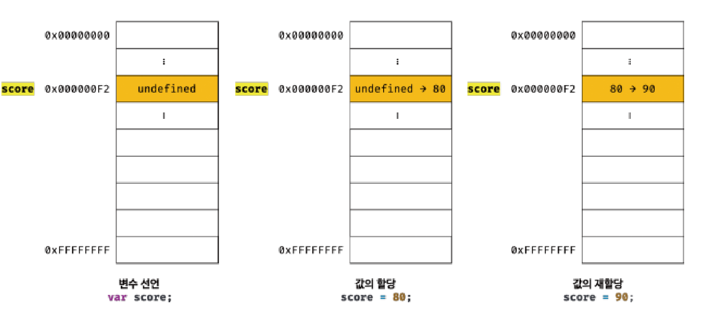

# 자바스크립트 딥다이브 개념 발표

## 08. 원시값과 객체 비교

- 자바스크립트가 제공하는 7가지 데이터 타입(숫자, 문자열, boolean, null, undefined, symbol, 객체 타입)은 원시 타입(primitive type)과 객체 타입(object/reference type)으로 구분할 수 있다.

- 원시 타입과 객체 타입의 차이점

<br>

| 원시 타입                                                                                                    | 객체 타입                                                                                                             |
| :----------------------------------------------------------------------------------------------------------- | :-------------------------------------------------------------------------------------------------------------------- |
| 원시값은 변경 불가능한 값                                                                                    | 객체(참조) 타입의 값은 변경가능한 값                                                                                  |
| 원시값을 변수에 할당하면 변수(확보된 메모리 공간)에는 실제 값이 저장됨                                       | 객체를 변수에 할당하면 변수(확보된 메모리 공간)에는 참조값이 저장됨                                                   |
| 원시값을 갖는 변수를 다른 변수에 할당하면 원본의 원시값이 복사되어 전달됨<br>(값에 의한 전달. call by value) | 객체를 가리키는 변수를 다른 변수에 할당하면 원본의 참조 값이 복사되어 전달됨<br>(참조에 의한 전달. call by reference) |

<br>

### :one: 원시 값

- 원시 타입의 값 (primitive value. 원시 값)
- 변경 불가능한 값임 (한번 생성된 원시 값은 읽기 전용 값으로서 변경할 수 없음)<br>
  => 따라서 데이터의 신뢰성을 보장함

- 변수

  - 하나의 값을 저장하기 위해 확보한 메모리 공간 자체 (혹은 해당 메모리 공간을 식별학 위해 붙인 이름)
  - 재할당을 통해 변수의 값을 변경할 수 있음
  - 새롭게 재할당한 원시값임 (이전의 원시값을 변경하지 않고 새로운 메모리 공간을 확보하고 재할당한 원시 값을 저장하므로)<br>
    => 변수가 참조하던 메모리 공간의 주소가 바뀜

    

    <br>

- 상수

  - 재할당이 금지된 변수
  - 단 한번만 할당이 허용되므로 변수의 값을 변경할 수 없음

- 값
  - 변수에 저장된 데이터로서 표현식이 평가되어 생성된 결과
  - 변경이 불가능 (변수는 변경가능)

#### 원시 값의 특징

- 원시 값은 변경 불가능한 값이기 때문에 변수가 참조하던 메모리 공간의 주소가 변경된 것이다.<br>(원시 값이 변경 가능한 값이라면 변수에 새로운 원시 값을 할당했을 때 변수가 가리키던 메모리 공간의 주소를 바꿀 필요없이 값 자체를 변경하면 됨 <br> => 메모리 공간의 주소가 바뀌지 않음)


##### 그림 - 원시 값이 변경 가능한 값인 경우 


- 불변성을 갖는 원시값을 할당한 변수는 `재할당`을 통해서만 값을 변경할 수 있다

- 만약 재할당 이외에 원시값을 할당한 변수값을 바꿀 수 있는 방법이 있다면 상태 변경을 추적하기 어려울 것이다.

<br>

### :two: 문자열과 불변성

- 문자열

  - 0개 이상의 문자로 이루어진 집합
  - 1개의 문자는 2byte의 메모리 공간에 저장됨
  - 문자열은 몇 개의 문자로 이루어졌냐에 따라 메모리 공간의 크기가 달라짐<br> (반면 숫자는 1과 1000000 모두 동일하게 8byte의 메모리 공간을 필요로 함)

    - 1개의 문자로 이루어진 문자열은 2byte의 메모리 공간을, 10개의 문자로 이루어진 문자열은 20byte의 메모리 공간을 필요로 할 것이다

  - 자바스크립트의 문자열은 원시 타입이다 (문자열이 생성된 이후에는 변경할 수 없다)<br> => 원시 값은 어떤일이 있어도 변하지 않으므로 예기치 못한 변경으로부터 자유롭다<br> => 데이터의 신뢰성을 보장한다.

    - 새로운 문자열을 할당하는 과정

      ```js
      var str = "hello"; // 1)
      str = "world"; // 2)
      ```

      - 2)의 과정에서는 이전에 생성된 'hello'라는 문자열을 수정하는 것이 아니라 새로운 문자열인 'world'를 메모리에 생성하고 'hello'를 가리키던 식별자 str이 'world'를 가리키게 되는 것이다. (메모리상에는 문자열 'hello'와 'world'가 모두 존재한다.)

#### 유사 배열 객체 (array-like object)

- 배열처럼 인덱스로 프로퍼티 값에 접근할 수 있고 length 프로퍼티를 갖는 객체를 뜻함
- 문자열은 배열처럼 인덱스를 통해 각 문자에 접근할 수 있으며, length 프로퍼티를 가지므로 유사 배열 객체이다

```js
var str = "hello";

console.log(str[0]); // h

/* 원시 값인 문자열이 객체처럼 동작함 */
console.log(str.length); // 5
console.log(str.toUpperCase); // HELLO
```

<br>

### :three: 값에 의한 전달

- 변수에 원시 값을 갖는 변수를 할당하면 할당받는 변수에는 할당되는 변수의 원시값이 복사되어 전달되는 과정

```js
var score = 80;
var copy = score;

console.log(score, copy); // 80 80
console.log(score === copy); // true
```


- score 변수와 copy 변수는 갖은 숫자 값을 가진다. 하지만 `각각은 다른 메모리 공간에 저장된 별개의 값`이다.

- score 변수의 값을 변경해보면 차이점이 두드러진다

```js
var score = 80;
var copy = score;
console.log(score, copy); // 80 80
console.log(score === copy); // true

score = 100;
console.log(score, copy); // 100 80
console.log(score === copy); // false
```


- score 변수와 copy 변수는 다른 메모리 공간에 저장된 별개의 값이다. <br>=> 따라서 score 변수의 값을 변경해도 copy 변수의 값에는 어떠한 영향도 주지 않는다

#### 자바스크립트상 전달에 대한 이견

- 값에 의한 전달
  - ECMAScript 사양에는 등장하지 않음
  - 자바스크립트를 위한 용어가 아니므로 오해가 있을 수 있음
  - 엄밀히 말해 변수에는 값이 전달되는 것이 아닌 메모리 주소가 전달됨<br>(변수와 같은 식별자는 값이 아닌 메모리 주소를 기억하고 있기 때문임)
    - 식별자는 특정한 값을 구별해서 식별해낼 수 있는 고유한 이름이다. 식별자는 메모리 공간상에 저장된 특정 값을 구별해서 식별해낼 수 있어야 하므로 메모리 주소를 기억하는 것임. (식별자가 값을 구별해서 식별할 수 있으므로 메모리 주소를 통해 메모리 공간에 저장된 값에 접근할 수 있음)

```js
var x = 10;
```

- 할당 연산자가 숫자 리터럴 10에 의해 생성된 숫자 값 10이 저장된 메모리 공간의 주소를 전달함
- 이로인해 식별자 x는 메모리 공간에 저장된 숫자 값 10을 식별할 수 있음

```js
var copy = score;
```

- score는 식별자 표현으로서 숫자 값 80으로 평가됨 => 두 가지 평가방식으로 나뉨

  1. 새로운 80을 생성(복사)해서 메모리 주소를 전달하는 방식. (할당 시점에 두 변수가 기억하는 메모리 주소가 다름)
  2. score의 변수 값 80의 메모리 주소를 그대로 전달하는 방식. (할당 시점에 두 변수가 기억하는 메모리 주소가 같음)

##### 결론

- '값에 의한 전달'도 실제로는 값을 전달하는 것이 아니라 메모리 주소를 전달함. <br>(단, 전달된 메모리 주소를 통해 메모리 공간에 접근하면 값을 참조할 수 있음)

- `두 변수의 원시값은 결과적으로 서로 다른 메모리 공간에 저장된 별개의 값이 되므로 어느 한쪽에서 재할당을 통해 값을 변경하더라도 서로 간섭할 수 없음`
