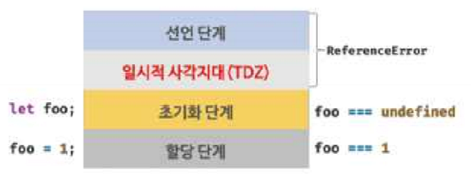

# [15장] let, const와 블록 레벨 스코프

## 15.1 var 키워드로 선언한 변수의 문제점

### :one: var 키워드로 선언한 변수는 중복 선언이 가능함

```js
var x = 1;
var y = 1;

var x = 100; // 중복 선언. 초기화문이 있는 변수 선언문
var y; // 초기화문이 없는 변수 선언문.

console.log(x); // 100
console.log(y); // 1
```

[예시](./duplicateDeclaration.js)

- var 키워드로 선언된 변수는 동일 스코프 내에서 중복 선언을 허용함
- 초기화문(변수 선언과 동시에 초기값을 할당하는 문)이 있는 변수 선언은 자바스크립트 엔진에 의해 var 키워드가 없는 것처럼 동작함<br>=> 위의 예시를 보면 재할당이 일어났음
- 초기화문이 없는 변수 선언문은 무시됨

- 동일한 이름의 변수가 이미 선언되어 있는 것을 모르고 변수를 중복 선언하면서 값까지 할당했다면 의도치 않게 먼저 선언된 변수 값이 재할당되어 변경되는 부작용이 발생함

<br>

### :two: 함수 레벨 스코프

- var 키워드로 선언한 변수는 오로지 함수 코드 블록만을 지역 스코프로 인정함<br>
  => 함수 외부에서 var 키워드로 선언한 변수는 코드 블록 내에서 선언해도 모두 전역 변수가 됨

```js
var x = 1; // 함수 외부에서 var 키워드로 선언한 변수

if (true) {
  var x = 10;
}

console.log(x); // 10
```

[예시](./functionLevelScope1.js)

- 함수 레벨 스코프의 영향을 받는것이 아니라 전역 레벨 스코프에서 선언한 것과 동일시 됨

<br><br>

```js
if (true) {
  var y = 20;
  console.log("함수 안의 y값: ", y); // 얘만 지역 스코프로 인정
}

var y = 10;
console.log("함수 밖의 y값: ", y);
```

[예시2](./functionLevelScope2.js)

<br><br>

```js
var i = 10;
for (var i = 0; i < 5; i++) {
  console.log(i);
}

console.log(i);
```

[예시3](./functionLevelScope3.js)

- for문에서 선언한 i는 전역 변수이다. 하지만 이미 선언한 전역 변수 i가 있으므로 중복 선언이 된다.
- for문 내에서 새로 선언된 i로 인해 i가 변질되었다. 중복 선언으로 인해 i의 값이 5로 변경되었다.

- 함수 외부에서 var 키워드로 선언하면 항상 전역 변수 취급을 받기 때문에 함수 레벨 스코프에서도 전역 변수를 남발할 가능성이 높아진다. 이로 인해 전역 변수가 중복 선언될 수도 있다. 따라서 var 키워드를 자제하는 것이 좋으며, 사용하더라도 스코프에 주의를 기울어야 한다.

<br>

### :three: 변수 호이스팅

- `var` 키워드로 변수를 선언할 경우 변수 호이스팅에 의해 변수 선언문이 스코프의 선두로 끌어 올려진 것처럼 동작한다.
- 즉, 변수 호이스팅에 의해 var 키워드로 선언한 변수는 변수 선언문 이전에 참조할 수 있게된다.<br> => 단, 할당문 이전에 변수를 참조할 경우 언제나 undefined를 반환한다.

```js
console.log("변수 선언 및 할당전의 foo: ", foo); // 가)

foo = 123; // 나)
console.log("변수 할당만 한 상태의 foo: ", foo); // 다)

var foo; // 라)
console.log("변수 선언 및 할당을 한 상태의 foo: ", foo); // 마)
```

#### 예제 해석

- 가)

  - :one: 선언단계 - 변수 호이스팅에 의해 이 시점에는 이미 변수 foo가 선언되었다고 봄
  - :two: 초기화 단계 - 변수 foo는 undefined로 초기화 됨
  - 변수 호이스팅에 의해 할당문 이전에 변수를 참조하였으므로 undefined를 반환함

- 나) :three: 할당 단계
- 라) 변수 선언
  - 변수 선언은 런타임 이전에 자바스크립트 엔진에 의해 암묵적으로 실행됨

#### 결론

- 변수 선언문 이전에 변수를 참조하는 것은 프로그램의 흐름상 적절하지 않음
  - 가독성을 떨어뜨림
  - 오류를 발생시킬 확률이 높아짐

<br>

## 15.2 let 키워드

### 15.2.1 변수 중복 선언 금지

- let 키워드로 이름이 같은 변수를 중복 선언할 경우 문법 에러(Syntax Error)가 발생함

```js
let bar = 123; // let이나 const로 선언된 변수는 같은 스코프 내에서 중복 선언을 허용하지 않음
let bar = 456; // SyntaxError: Identifier 'bar' has already been declared
```

[예제](./duplicateLetDeclaration1.js)

### 15.2.2 블록 레벨 스코프

- let 키워드로 선언한 변수는 모든 코드 블록을 지역 스코프로 인정하는 블록 레벨 스코프(block level scope)를 따름<br>(var 키워드로 선언한 변수는 오로지 함수의 코드 블록만을 지역 스코프로 인정하는 함수 레벨 스코프를 따름)

```js
let foo = 1;
console.log("전역 변수로서의 foo: ", foo);

{
  let foo = 2;
  console.log("지역 변수로서의 foo: ", foo);
  console.log();

  let bar = 3;
  console.log("지역 변수로서의 bar: ", bar);
}

console.log();

console.log(foo); // 1
console.log(bar); // ReferenceError: bar is not defined
```

[예제](./blcokLevelScope1.js)

- 위 예제에서는 bar 변수가 블록 레벨 스코프를 갖는 지역 변수이므로 전역에서 bar 변수를 참조할 수 없다.
  - 전역에서 bar변수를 참조할 수 없는데 참조하려고 헀으므로 ReferenceError가 발생하는 것이다

#### 전역 & 함수 레벨 & 블록 레벨 스코프 톺아보기

```js
/* 전역 스코프 */
let i = 10;
console.log("전역 스코프의 i: ", i);

/* 함수 레벨 스코프 */
function foo() {
  let i = 100;
  console.log("함수 레벨 스코프의 i: ", i);

  for (let i = 0; i < 5; i++) {
    console.log("블록 레벨 스코프의 i: ", i);
  }
  console.log(i);
}

foo();
console.log("전역 스코프의 i: ", i);
```

[예제](./allOfScope1.js)

<br>

### 15.2.3 변수 호이스팅

#### 예제1

- (var 키워드로 선언한 변수와 달리)let 키워드로 선언한 변수는 변수 호이스팅이 발생하지 않는 것처럼 동작함
- let 키워드로 선언한 변수를 변수 선언문 이전에 참조할 경우 참조 에러(Reference Error)가 발생함

```js
console.log(foo); // ReferenceError: foo is not defined
let foo;
```

#### 예제2

```js
console.log(foo); // undefined

var foo;
console.log(foo); // undefined

foo = 1;
console.log(foo); // 1
```

- var 키워드로 선언한 변수는 런타임 이전에 자바스크립트 엔진에 의해 암묵적으로 '선언 단계'와 초기화 단계'가 한번에 이루어진다.
- 즉, 선언 단계에서 스코프(실행 컨텍스트의 렉시컬 환경)에 변수 식별자를 등록해서 자바스크립트 엔진에 변수의 존재를 알린다.
- 그리고 즉시 초기화 단계에서 undefined로 변수를 초기화한다.
- 따라서 변수 선언문 이전에 변수에 접근해도 스코프에 변수가 존재하기 때문에 에러가 발생하지 않는다. (다만 undefined를 반환한다)
- 이후 변수 할당문에 도달하면 비로소 값이 할당 된다.

- [실행 컨텍스트 참고자료](https://www.youtube.com/watch?v=EWfujNzSUmw)

#### 예제3

```js
console.log(foo); // Reference Error

let foo; // 변수 선언문 (에서 초기화 단계가 실행됨)
console.log(foo); // undefined

foo = 1; // 할당문 (에서 할당 단계가 실행됨)
console.log(foo); // 1
```

- `let 키워드로 선언한 변수는 '선언 단계'와 '초기화 단계'가 분리되어 진행된다.`
- 즉, 런타임 이전에 자바스크립트 엔진에 의해 암묵적으로 선언 단계가 먼저 실행되지만 초기화 단계는 변수 선언문에 도달했을 때 실행된다.

- 만약 초기화 단계가 실행되기 이전에 변수에 접근하려고 하는 경우 참조 에러(Reference Error)가 발생한다.
- let 키워드로 선언한 변수는 스코프의 시작 지점부터 초기화 단계 시작 지점(변수 선언문)까지 변수를 참조할 수 없다.

##### 일시적 사각지대 (TDZ, Temporal Dead Zone)



- 스코프의 시작 지점부터 초기화 시작 지점까지 변수를 참조할 수 없는 구간을 `일시적 사각지대`라 부름
- 여기서는 `맨 처음`부터 ~ `let foo;`시작 지점까지가 TDZ이다.

#### 예제 4

- let 키워드로 선언한 변수는 변수 호이스팅이 발생하지 않는 것처럼 보인다. 하지만 실제로는 그렇지 않다.

```js
let foo = 1; // 전역 변수
{
  console.log(foo); // Reference Error
}
```

- let 키워드로 선언한 변수의 경우 변수 호이스팅이 발생하지 않는다면 전역 변수 foo의 값을 출력해야 한다. 하지만 let 키워드로 선언한 변수도 여전히 호이스팅이 발생하기 때문에 참조 에러 (Reference Error)가 발생한다.
- 자바스크립트는 ES6에서 도입된 let, const를 포함해서 모든 선언 (var, let, const, function, function\*, class 등)을 호이스팅한다. <br>(단, ES6에서 도입된 let, const, class를 사용한 선언문은 호이스팅이 발생하지 않는 것처럼 동작한다.)

- [호이스팅 참고자료](https://tecoble.techcourse.co.kr/post/2021-04-25-hoisting/)

<br>

### 15.2.4 전역 객체와 let

- var 키워드로 선언한 전역 변수와 전역 함수, 그리고 선언하지 않은 변수에 값을 할당한 암묵적 전역은 전역 객체 `window`의 프로퍼티가 된다.
- 전역 객체의 프로퍼티를 참조할 때 window를 생략할 수 있다.

#### 예제 1

```js
/* 브라우저에서 실행할 것 */
var x = 1; // 전역 변수
y = 2; // 암묵적 전역

function foo() {} // 전역 함수

console.log(window.x); // 가)
console.log(x); // 나)

console.log(window.y); // 다)
console.log(y); // 라)

console.log(window.foo); // 마)
console.log(foo); // 바)
```

- 가)

  - var 키워드로 선언한 전역 변수는 전역 객체 window의 프로퍼티이다.
  - 1

- 나)

  - 1
  - 전역 객체 window의 프로퍼티는 전역 변수처럼 사용할 수 있다.

- 다)

  - 2
  - 암묵적 전역은 전역 객체 window의 프로퍼티이다.

- 라)

  - 2
  - 암묵적 전역은 전역 객체 window의 프로퍼티이다.

- 마)

  - foo() {}
  - 함수 선언문으로 정의한 전역 함수는 전역 객체 window의 프로퍼티이다

- 바)
  - foo() {}
  - 전역 객체 window의 프로퍼티는 전역 변수처럼 사용할 수 있다

<br>

#### 예제2

```js
/* 브라우저 환경에서 실행할 것 */
let x = 1;

console.log(window.x); // undefined
console.log(x); // 1
```

- 핵심
  - let, const 키워드로 선언한 전역 변수는 전역 객체 window의 프로퍼티가 아니다

<br>

## 15.3 const 키워드

### 15.3.1 선언과 초기화

```js
const foo = 1;
```

```js
const foo;   // SyntaxError: Missing initializer in const declaration
```

- const 키워드로 선언한 변수는 반드시 선언과 동시에 초기화를 해야 함

- 그렇지 않으면 문법에러가 발생함

- const 키워드로 선언한 변수는 let 키워드로 선언한 변수와 마찬가지로 블록 레벨 스코프를 가지며, 변수 호이스팅이 발생하지 않는 것처럼 동작함

<br>

### 15.3.2 재할당 금지

```js
const foo = 1;
foo = 2; // TypeError: Assignment to constant variable
```

- var이나 let으로 선언한 변수는 재할당이 자유로우나 `const 키워드로 선언한 변수는 재할당이 금지됨`

<br>

### 15.3.3 상수

- 상수
  - 재할당이 금지된 변수
  - 값을 저장하기 위한 메모리 공간이 필요하므로 변수라고 할 수 있음
  - 상태 유지와 가독성, 유지보수의 편의를 위해 적극적으로 사용하는것이 좋음
  - const 키워드를 사용해서 상수를 표현할 수 있음

#### 예제1

```js
let preTaxPrice = 100; // 세전 가격
let afterTaxPrice = preTaxPrice + preTaxPrice * 0.1; // 세후 가격
console.log(afterTaxPrice); // 110
```

- 0.1의 의미를 알기 어렵기 때문에 가독성이 떨어짐
- 세율 0.1은 쉽게 바뀌지 않으므로 프로그램 전체에 고정된 값을 사용하는 것이 좋음<br>(의미 파악이 용이해짐)

#### 예제2 (예제1 수정 버전)

```js
const TAX_RATE = 0.1; // 세율
let preTaxPrice = 100; // 세전 가격
let afterTaxPrice = preTaxPrice + preTaxPrice * TAX_RATE; // 세후 가격

console.log(afterTaxPrice); // 110
```

- 상수
  - 상수명은 보통 대문자로 선언하여 상수임을 명확히 드러냄.
  - 여러 단어로 이루어진 경우 언더스코어(\_)로 구분해서 스네이크 케이스로 표현하는 것이 일반적임

<br>

### 15.3.4 const 키워드와 객체

```js
const person = { name: "Lee" };

person.name = "Kim"; // 객체는 변경가능한 값. 재할당 없이 직접 변경이 가능
console.log(person); // {name: 'Kim'}
```

- const 키워드로 선언된 변수에 (원시값이 아닌)객체를 할당한 경우 값을 변경할 수 있다
- 변경 불가능한 값인 원시 값은 재할당 없이 변경(교체)할 수 있는 방법이 없지만 변경 가능한 값인 객체는 재할당 없이도 직접 변경이 가능함

- 핵심
  - `const 키워드는 재할당을 금지할 뿐 '불변'을 뜻하는 것이 아님`
  - 즉, 새로운 값을 재할당하는 것은 불가능하나 프로퍼티의 동적 생성/삭제/프로퍼티 값의 변경을 통해 객체를 변경하는 것은 가능함

<br>

## 15.4 var VS let VS const

| 키워드 | 내용                                                                                                                                                                                                                                                                                                                            |
| :----- | :------------------------------------------------------------------------------------------------------------------------------------------------------------------------------------------------------------------------------------------------------------------------------------------------------------------------------ |
| var    | ES6를 사용한다면 var 키워드는 사용하지 않는다.                                                                                                                                                                                                                                                                                  |
| let    | 변수선언에는 기본적으로 const를 사용하고 let은 재할당이 필요한 경우에 한정해서 사용하는게 좋음<br>(const 키워드 사용시 의도치 않은 재할당을 방지하기 때문에 좀 더 안전함)재할당이 필요한 경우에 한정해 let 키워드를 사용한(이때 변수의 스코프는 최대한 좁게 만듦)<br>                                                           |
| const  | 변수선언에는 기본적으로 const를 사용하고 let은 재할당이 필요한 경우에 한정해서 사용하는게 좋음<br>(const 키워드 사용시 의도치 않은 재할당을 방지하기 때문에 좀 더 안전함)<br> 변경이 발생하지 않고 읽기 전용으로 사용하는 원시값과 객체에는 const 키워드를 사용함(const키워드는 재할당을 금지하므로 var, let 키워드보다 안전함) |
