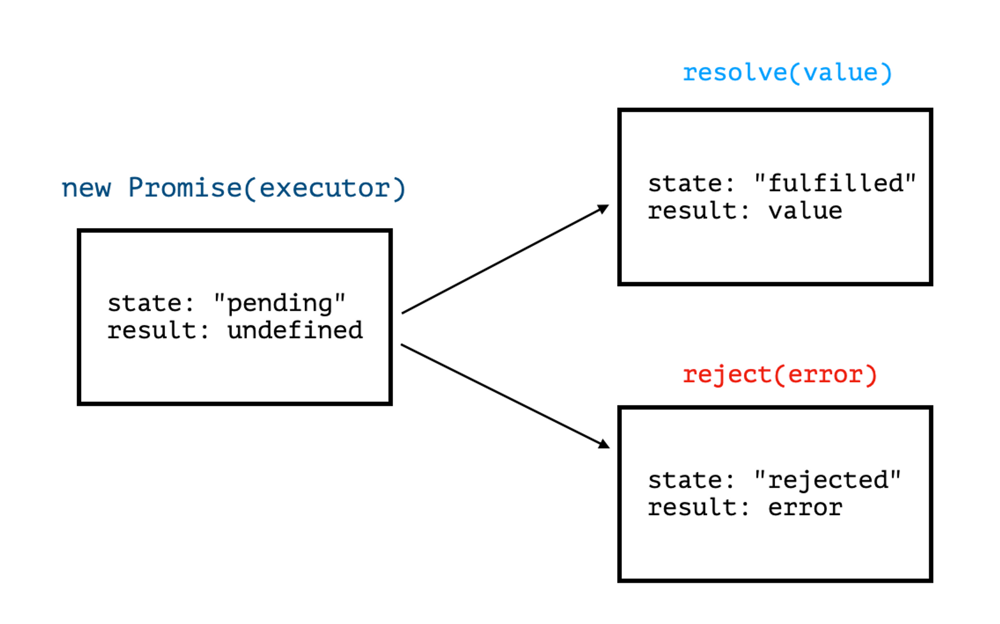
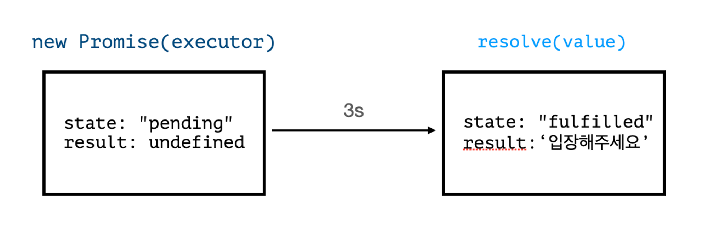
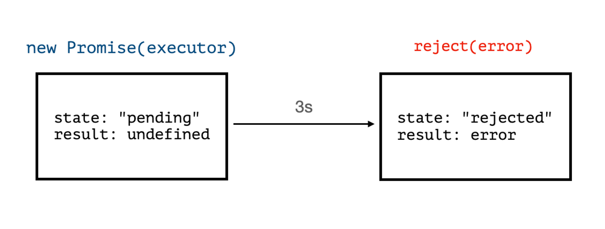
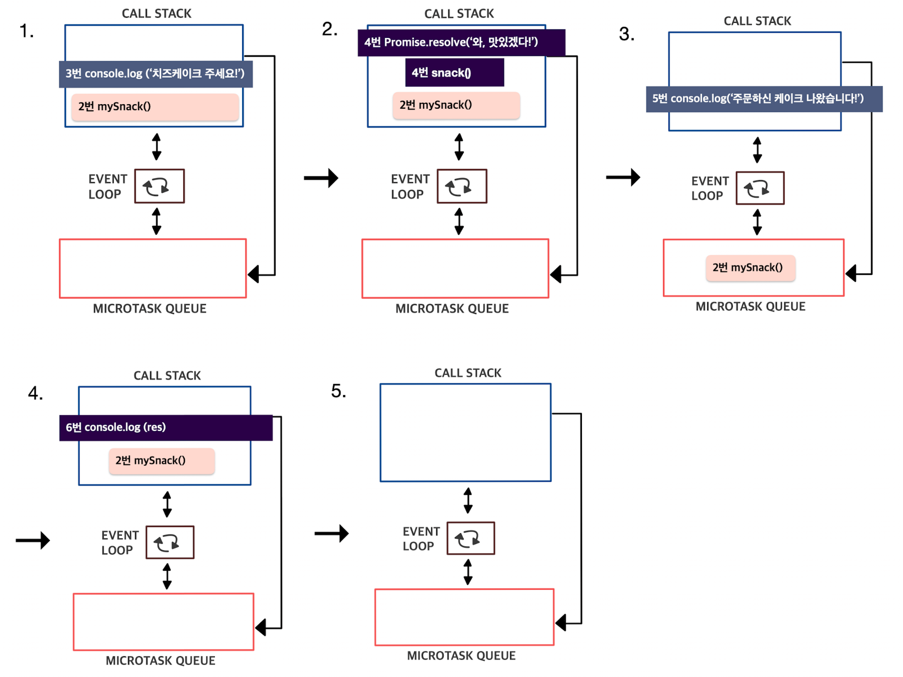

# 비동기처리

## 비동기 처리의 종류

1. Promise (ES6)
2. await/async (ES2017)
3. fetch

## 콜백함수

- 다른 함수에 인자로 전달되는 함수
- 특정 이벤트가 발생하거나 특정 시점이 되었을 때 다시 호출되는 함수

- `forEach`, `map`, `filter`

### 콜백지옥

- 콜백함수를 익명 함수로 전달하는 과정에서 또 다시 콜백 함수 안에 함수 호출이 반복되어 코드의 들여쓰기 수준이 감당하기 힘들 정도로 깊어지는 현상

- 콜백지옥은 가독성이 떨어지고 코드 수정이 어렵기 때문에 에러를 해결하거나 유지보수를 하는데에 있어 어려움이 따른다

#### 콜백 지옥 해결하기

- 콜백 지옥을 탈출하기 위한 방법으로는 `기명함수`를 사용하는 것이 있으나, 이러한 방법에는 문제가 있다<br>
  - 변수명을 일일이 다 지어주어야 함
  - 거꾸로 코드를 거슬로 올라가며 코드명을 일일이 따라가야함
  - 전 단계에서 정의된 변수등을 다음 함수에서 사용할 수 없음
  - 바깥쪽에서 변수를 선언해서 사용해야 함
    <br> => 이를 해결하기위해 `Promise`, `await/async`등을 사용하면 좋다

<br>

## Promise

- 응답에 관한 정보를 갖고 있는 객체
- `then & catch`를 통해 결과 값을 처리함

- 자바스크립트 객체로서 비동기 처리가 필요한 경우 콜백함수를 대신하여 사용

- 시간이 얼마나 걸리든 상관없이 약속한 결과를 만들어 내는 `제작 코드`가 준비되었을 때
, 모든 `소비 코드`가 결과를 사용할 수 있도록 해줌


### Promise 문법

```js
const promise = new Promise((resolve, reject) => {
	console.log("1번손님 들어오세요");
    // executor(제작코드,실행함수) = 맛집
});
```
- `executor`
  - new Promise에 전달되는 함수
  - executor 함수는 자동으로 실행되며 처리 성공 여부에 따라 resolve나 reject를 호출함
  - `resolve`: 일이 성공적으로 끝난 경우 value와 함께 호출
  - `reject`: 에러 발생시 에러 객체를 나타내는 error와 함께 호출

#### Promise의 상태 & 결과



- `pending (대기)`
  - 처리가 완료되지 않은 상태


- `fulfilled (이행)`
  - 성공적으로 처리가 완료된 상태


- `rejected (거부)`
  - 처리가 실패로 끝난 상태


#### 예제 (resolve)



```js
const promise = new Promise((resolve, reject) => {
// promise가 만들어지면 executor함수는 자동으로 실행된다.
	setTimeout(()=>{
		resolve('입장해주세요');
	}, 3000);
}); // 3초후 일이 성공적으로 끝났다는 신호와 함께 result는'입장해주세요'가 된다.
```

- 결과 진행상황
```js
Promise {<pending>} 
  
  [[Prototype]]: Promise 
  [[PromiseState]]: "fulfilled"
  [[PromiseResult]]: "입장해주세요"
```

```js
Promise {<fulfilled>: '입장해주세요'}

  [[Prototype]]: Promise
  [[PromiseState]]: "fulfilled"
  [[PromiseResult]]: "입장해주세요"
```


#### 예제 (reject)



```js
const promise = new Promise((resolve, reject) => {
    setTimeout(() => {
        reject(new Error('error'))
    },3000);
})
```

3초 뒤에 에러와 함계 실행이 종료되었다는 신호를 보냄

#### 유의사항

- 프로미스는 성공 또는 실패만 반환해야 함
<br> (executor는 `resolve` 또는 `reject` 중 하나를 반드시 호출 해야함)


- 이미 변경된 상태는 더 이상 변하지 않음
<br> (처리가 완료된 프로미스에 `resolve`와 `reject`를 호출하면 무시됨)


```js
const promise = new Promise(function(resolve, reject) {
  resolve("1번손님 입장해주세요");
  reject(new Error("~")); // 무시된다
  setTimeout(() => resolve("~")); // 무시된다
});
```

- executor에 의해 처리가 끝난 일은 결과 또는 에러만 가짐

<br>

### 소비함수 메서드: then, catch, finally

- `executor`
  - `new Promise`에 전달되는 함수
  - `new Promise`가 만들어질 때 자동으로 실행됨
  - 결과를 최종적으로 만들어내는 제작 코드를 포함


- 소비코드는 `then`, `catch`, `finally` 등과 같은 메서드를 이용해
Promise에 번호를 등록할 수 있음


#### then

```js
//제작코드(producing code)
const promise = new Promise((resolve, reject) => {
	setTimeout(() => {
		resolve('입장해주세요');
	}, 3000);
});

//소비코드(consuming code)
promise.then(value => {
	console.log(value);
});

// Promise{<pending>}
// 입장해주세요
```

`then`은 프로미스가 정상적으로 잘 수행되어서 최종적으로 `resolve`라는 
콜백함수를 통해 전달된 값이 value의 파라미터로 전달되어서 들어옴


- 예제
```js
 //제작코드(producing code)
const promise = new Promise((resolve, reject) => {
  setTimeout(() => {
    reject(new Error('손님의 입장순서가 아닙니다'));
  }, 3000);
});

//소비코드(consuming code)
promise.then(value => {
  console.log(value);
});
```
실행결과


#### catch

- 에러가 발생한 경우 `.catch`에러 에러를 잡음

```js
//제작코드(producing code)
const promise = new Promise((resolve, reject) => {
	setTimeout(() => {
		reject(new Error('손님의 입장순서가 아닙니다'));
	}, 3000)
});

//소비코드(consuming code)
promise
	.then(value => {
		console.log(value);
	})
	.catch(error => {
	  console.log(error);
	});

// 콘솔창에 에러메시지 출력
```

- 프로미스 체이닝
  - 프로미스에 `then`을 호출하게 되면 `then`이 결국 같은 프로미스를 리턴한다.
  - 이때 리턴된 프로미스에 `catch`를 다시 호출할 수 있는 것을 `프로미스 체이닝`이라 함


#### finally

- 성공/실패 여부와 상관없이 항상 호출되는 메서드

```js
//제작코드(producing code)
const promise = new Promise((resolve, reject) => {
	setTimeout(() => {
		reject(new Error('손님의 입장순서가 아닙니다'));
	}, 3000)
});

//소비코드(consuming code)
promise
	.then(value => {
		console.log(value);
	})
	.catch(error => {
	  console.log(error);
	})
	.finally(() => {
		console.log('-제주맛집');
	});
```

<br>

## await/async

- Promise를 기반으로 하지만 then & catch를 사용하지 않고, `try-catch`를 사용함


### async function (async/await)는 왜 등장했을까?

- 프로미스는 비동기 작업량이 늘어나더라도 콜백함수처럼 코드의 깊이가 깊어지지 않는다는 장점이 있으나 다음과 같은 문제점이 존재함

1. 특정 부분에 따라 분기를 나누기가 어려움
2. 어떤 부분에서 에러가 발생했는지 파악하기가 어려움
3. 프로미스 체이닝이 반복되면 가독성이 떨어져서 `.then` 지옥이 발생할 가능성이 높아짐
<br>

=> 이러한 문제를 해결하기 위해 `async/await` 가 등장함


### async & await 사용

- 비동기 처리가 되어야 하는 메서드 앞에 `await` 키워드를 붙여서 사용함
- 비동기 처리 메서드는 반드시 프로미스 객체를 반환해야 의도한대로 동작하며 프로미스를 반환하는 API 호출 함수가
`await`의 대상이 되는 코드임

```js
async function 함수명(){
    await 비동기 처리 메서드명();
}
```

```js
const 함수명 = async () => {
    await 비동기처리 메서드명();
}
```

#### await 키워드 사용시 유의할 점

- `await` 키워드 
  - 반드시 `async`함수 내부에서만 사용해야함
  - 프로미스 앞에서 사용해야 함
  - 만약 async 외부에서 사용할 경우 `Syntax Error`


### async & await의 제어 흐름

```js
const snack = () => Promise.resolve('와, 맛있겠다!') 

async function mySnack() {
		console.log('치즈 케이크 주세요!') 
    const res = await snack() 
    console.log(res) 
}

console.log('주문하시겠어요?') 
mySnack();
console.log('주문하신 케이크 나왔습니다!') 

```

- 출력결과
```js
'주문하시겠어요?'
'치즈 케이크 주세요!'
'주문하신 케이크 나왔습니다!'
'와, 맛있겠다!'
```

- mySnack() 부터의 실행 흐름 과정 살펴보기



1. 비동기 함수 mySnack() 호출
<br> => mySnack()의 body가 동작
<br> => console.log() 호출하면서 `치즈 케이크 주세요!`를 출력하면 콜스택을 빠져나옴


2. mySnack() body상 2번쨰 라인의 `snack()`이 콜스택 안으로 들어감
<br> => resolve된 프로미스를 리턴함 
<br> => 프로미스가 resolve되고 `snack()`이 값을 리턴할 때, 엔진은 await 키워드를 마주침


3. 이때 body의 실행이 멈추고 `mySnack()` 함수가 마이크로테스크 큐에서 대기하면
엔진은 비동기 함수에서 나와서 `console.log('주문하신 케이크 나왔습니다!')`를 출력


4. 콜스택에 더이상 실행할 작업이 남아있지 않으므로 이벤트 루프는 마이크로테스크에 남은 작업이 있는지를
확인함
<br> => 이떄 mySnack()은 `snack()`을 resolve한 다음 자신의 차례를 기다리고 있는 것을 발견
<br> => `mySnack()`은 다시 콜스택으로 들어가고 res변수는 `snack()`의 리턴값인 `와, 맛있겠다`를 전달받음
<br> => 콘솔에 `와, 맛있겠다!`가 출력되고 콜스택에서 빠져나옴


5. 모든 작업이 끝남


<br>

## fetch

- 접근하고자 하는 url과 매개변수로 네트워크 요청을 보낼 수 있음

