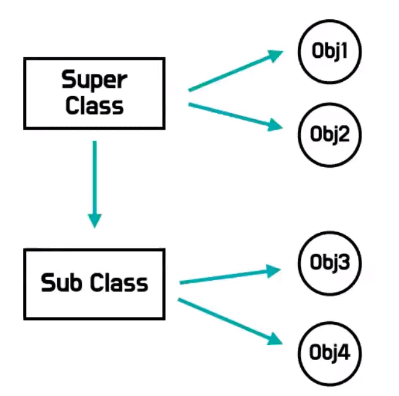
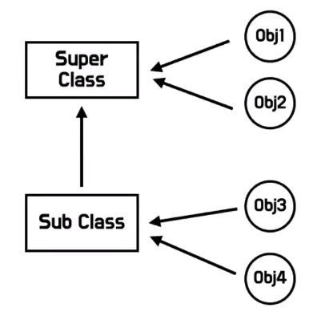

# 클래스

- 자바스크립트만의 사용자 정의 타입 생성 방법을 다른 언어의 클래스 문법처럼 바꿔 준것이 `자바스크립트 클래스`

## 클래스 vs 생성자 함수

- js는 본디 클래스가 필요없는 프로토타입 기반의 객체지향 언어였으나 클래스 기반 프로그래밍에 익숙했던
프로그래머들이 이와 같은 언어 구성방식에 혼란을 느껴 ES6부터 클래스가 추가 되었음

- 클래스와 생성자 함수의 차이점

|클래스|생성자 함수|
|:---:|:---:|
|new 연산자 없이 호출하면 에러 발생|new 연산자 없이 호출하면 일반 함수로서 호출됨|
|상속을 지원하는 extends, super 키워드 제공|extends, super 키워드 제공하지 않음|
|암묵적으로 strict mode가 지정|암묵적으로 strict mode가 지정되지 않음|


## 클래스의 특징

- 클래스는 생성자를 이용한 타입 생성과 그 결과가 일치함
- 세상에 있는 객체들을 공통적인 특징으로 모아서 클래스로 정의할 수 있음
- 클래스명은 보통 파스칼케이스로 명명함
- 클래스는 런타임에 생성이 가능함
- 변수나 자료구조(객체, 배열 등)에 저장할 수 있음
- 함수의 매개변수에게 전달될 수 있음
- 함수의 반환값으로 사용할 수 있음


## 인스턴스

- 인스턴스 생성시 생성자 함수와 동일하게 `new`키워드를 사용함
```js
new Person(Danny, 23)
```

## 생성자

- 클래스로 객체를 생성하고 초기화하기 위한 메서드

```js
class Person{
    constructor(name, age){
        this.name = name;
        this.age = age;
    }
}
```

- 암묵적으로 `this.인스턴스`를 반환
<br> => 따라서 내부에 리턴문이 있으면 안됨


- 클래스의 body에는 최대 1개의 생정자가 정의될 수 있으며 이를 정의하지 않을 경우
암시적으로 빈 생성자가 정의됨

## 프로토타입 메서드

- 클래스의 body에서 정의한 메서드


```js
class Person{
    constructor(name, age){
        this.name = name;
        this.age = age;
    }
    /* 프로토타입 메서드 */
    sayHello(){
        console.log(`저의 이름은 ${this.name}입니다.`);
    }
}
```

## static 메서드

- 인스턴스를 생성하지 않아도 호출할 수 있는 메서드

```js
class Person{
    constructor(name, age){
        this.name = name;
        this.age = age;
    }
    /* 프로토타입 메서드 */
    sayHello(){
        console.log(`저의 이름은 ${this.name}입니다.`);
    }
    
    /* static 메서드 */
    static iAmHuman(){
        console.log("저는 사람입니다");
    }
}
```


## 클래스를 사용하지 않은 예시

```js
/* 클래스를 사용하지 않은 예시 */

/* 생성자 함수 */
function User2(name){
    this.name = name;
}

/* 메서드 추가시 prototype 이용 */
/* 사용자 정의 타입 */
User2.prototype.sayName = function(){
    console.log(this.name);
}

var user = new User2("Danny");
user.sayName();
```

- 타입을 생성함
- prototype chain이나 생성자 훔쳐오기 방식으로 할 수 있는 것은 클래스 방식을 이용해서 구현할 수 있다


## 클래스를 사용한 예시

```js
class User{
    /* 클래스의 생성자 함수 */
    constructor(name) {
        this.name = name;
    }

    /* 메서드 */
    sayName(){
        console.log(this.name);
    }
}

/* 클래스는 인스턴스를 만들어서 이용한다 */
var me = new User("Wade");
// 인스턴스 생성시 생성자 함수가 자동으로 실행됨

me.sayName();
```

- 클래스를 사용하지 않은 것에 비해 더 보기 좋고 편리하게 개선된 문법이므로 `슈가 신텍스`라 할 수 있음


## [사용자 정의 객체](https://opentutorials.org/module/1597/9783)


## 슈가 신택스 

- 내부적인 동작은 동일하지만 더 보기 좋고 편리하게 개선된 문법


## 클래스의 상속

- 타입 상속처럼 클래스 또한 상속이 가능하다
- 하위 클래스는 상위클래스의 특징을 포함하며 추가적인 특징을 더할 수 있다


```js
class Sausage{
    constructor(el1, el2){
        this.inside1 = el1;
        this.inside2 = el2;
    }

    /* 메서드 */
    taste(){
        return this.inside1
            +"와 "
            +this.inside2
            + " 맛이 난다!";
    }
}

var classicSausage = new Sausage("닭고기", "양파");
console.log(classicSausage.taste());

/* 상속받는 FireSausage */
class FireSausage extends Sausage{

}

/* 인스턴스 */
var classicFireSausage = new FireSausage("소고기","파");
console.log(classicFireSausage.taste());


/* inside1과 inside2가 잘 들어있는지 확인 */
console.log(classicSausage.inside1);
console.log(classicSausage.inside2);
```

- extends 연산자를 이용해 상위 타입의 프로퍼티를 상속 받을 수 있다

## super

```js
class Sausage{
    constructor(el1, el2){
        this.inside1 = el1;
        this.inside2 = el2;
    }

    /* 메서드 */
    taste(){
        return this.inside1
            +"와 "
            +this.inside2
            + " 맛이 난다!";
    }
}

var classicSausage = new Sausage("닭고기", "양파");
console.log(classicSausage.taste());

/* 상속받는 FireSausage */
class FireSausage extends Sausage{
    constructor(el1,el2,el3) {
        super(el1,el2);  // 얘가 없으면 에러 발생 (얘로 인해 상위의 constructor가 실행되었다고 볼 수있음)
        this.inside3 = el3;
    }

    flavor(){
        return this.inside3+"의 풍미도 있다!";
    }
}

/* 인스턴스 */
var classicFireSausage = new FireSausage("소고기","파","불");
console.log(classicFireSausage.taste());


/* inside1과 inside2가 잘 들어있는지 확인 */
console.log(classicFireSausage.inside1);
console.log(classicFireSausage.inside2);

console.log(classicFireSausage.flavor());
```

- super class의 생성자를 호출할 때 사용

```js
class Student extends Person {
    constructor(name, age, nickname){
// 생성자 내부의 생성자를 호출하면 조상클래스의 프로퍼티들이 모두 전달됨
        super(name, age);
        // 자손 클래스의 생성자에서 this 키워드를 사용하기전에만 사용할 수 있음

        this.nickname = nickname;
    }
    
    sayHello(){
        console.log(`학생 ${this.name}입니다`);
    }
}
```

- super를 참조하여 super class의 메서드를 호출


### super()를 삽입하지 않으면 에러가 남

- 프포퍼티를 추가하기 위해 자식 클래스에 constructor 함수를 선언하면 부모클래스의 constructor 함수를 덮어쓴다
- 이를 해결하기 위해서는 super 메서드가 필요하다
- super 메서드는 슈퍼타입의 생성자를 호출한다

- 즉, super() 메서드를 이용해서 자식 클래스의 생성자 함수가 부모 클래스의 생성자 함수를 덮어 씌우는것을 방지할 수 있다


### super() 참조

- 조상 클래스의 메서드를 교체하는 것이 아니라 일부 기능만 변경하고 싶을 때 super()를 참조함

```js
class Student extends Person {
    constructor(name, age, nickname){
// 생성자 내부의 생성자를 호출하면 조상클래스의 프로퍼티들이 모두 전달됨
        super(name, age);
        // 자손 클래스의 생성자에서 this 키워드를 사용하기전에만 사용할 수 있음

        this.nickname = nickname;
    }
    
    introduceMySelf(){
        console.log(`학생 ${this.name}입니다.`);
    }

    sayHello() {
        super.sayHello();
        this.introduceMySelf();
    }
    // 저의 이름은 김xx입니다
    // 학생 Danny입니다
}
```

`super.sayHello()`와 같이 메서드의 super()를 참조하게 되면 상위클래스의 메서드를 호출하여 사용할 수 있음

## 클래스는 함수이다

- 클래스는 함수의 한 종류임
- 함수 선언과 동일하게 런타임 이전에 선언되어 함수 객체가 생성됨
```js
console.log(typeof Student) // function
```


- 생성자 함수는 생성될 때 자동으로 prototype이 생성된다
```js
// Person.prototype
constructor: Person
sayHello: function
```

## 클래스 호이스팅

- 클래스는  let, const 키워드로 선언한 변수처럼 호이스팅됨
- 따라서 클래스 선언문 이전에 TDZ에 빠지기 때문에 호이스팅이 발생하지 않는것처럼 동작함


## 클래스 인스턴스 생성 과정

```js
class Person{
    constrcutor (name, age){
        // 빈 객체가 암묵적으로 생성되고 this에 바인딩됨
        
        console.log(this);  // Person()
    }
    
    // this에 바인딩되어 있는 인스턴스를 초기화함
    this.name;
    this.age;
    
    // 모든 과정들이 일어나면
    // 완성된 인스턴스가 바인딩된 this가 암묵적으로 반환됨
}
```

- 상속받는 클래스의 경우, 생성자 함수는 빈 객체를 만들고 this에 이 객체를 할당하는 부모
클래스의 생성자가 처리해주기를 기대함
<br> => 따라서 this를 사용하지 전에 `super`키워드를 꼭 사용해야 함


## 상속과 위임

### 상속



자손클래스가 부모클래스를 복사해서 시작하게 되므로 시작점이 다르게 되어 서로 다른 클래스가 됨
<br>
인스턴스들 또한 클래스를 복사하여 생성하므로 서로 연관관계가 없음

### 위임



조상클래스가 자손클래스를 포함함
<br>
따라서 각 인스턴스들이 연관관계가 있음

