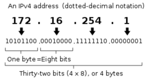

# IP

- 컴퓨터 네트워크에서 장치들이 서로를 인식하고 통신을 하기 위해서 사용하는 특수한 번호
- IP 주소는 Network ID와 Host ID로 이루어져 있음

## IPv4

- 크기가 32비트인 주소값으로 대게 dotted-decimal notation을 이용해 표기함
 (dot으로 구분된 각 숫자는 8비트씩(octet) 나타낼 수 있으며 0~255의 범위를 나타냄)

## IPv6

- IPv4의 32비트에서 128비트(16 octet)으로 증가하여 더 많은 IP주소를 할당할 수 있는 주소
- IPv4의 주소가 모자라게되면서 IPv4는 더 많은 주소를 네트워크에 할당하기 위해 Network Fragmentation이 지속적으로 증가하게되어 라우터에 많은 부담을 주고있어 이를 해결하기위해 IPv6가 새로 설계되었음

