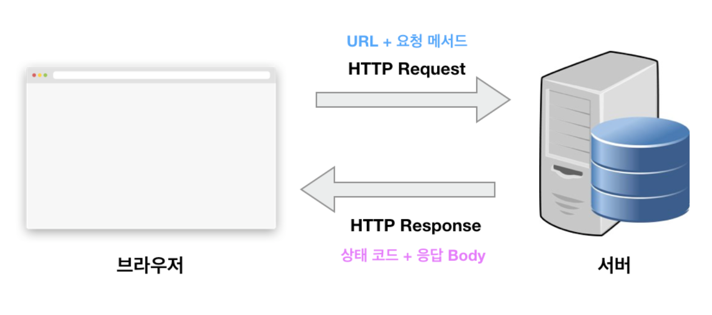

# HTTP 프로토콜

- HyperText Transfer Protocol 프로토콜 
- 웹상 브라우저와 서버간 데이터를 주고받기 정의된 약속

## HTTP 프로토콜의 특징

### :one: 상태가 없는 프로토콜 (stateless)

- 데이터를 주고 받기 위한 각각의 데이터 요청이 서로 독립적으로 관리됨
<br> (이전 데이터 요청과 다음 데이터 요청은 독립적)


- 따라서 서버는 세션과 같은 별도의 추가 정보를 관리하지 않아도 되고,
다수의 요청 처리 및 서버의 부하를 줄일 수 있다는 성능상의 이점이 생김

  
- HTTP 프로토콜은 일반적으로 TCP/IP 통신 위에서 동작함


- HTTP 프로토콜의 기본 포트는 80번임


<br>

## HTTP request & HTTP response

- HTTP 프로토콜로 데이터를 주고 받기위해서 요청(request)을 보내고 응답(response)을 받아야 함




<br>


## HTTP request method

- 서버에 특정 데이터를 요청할때 특정 동작을 수행하고 싶은 경우 HTTP request method를 이용함


- 다믕과 같은 메서드를 이용하여 데이터에 대한 `조회/생성/변경/삭제`등이 동작을 수행할 수 있음

### GET

- 존재하는 자원에 대한 요청

### POST

- 새로운 자원을 생성

### PUT

- 존재하는 자원에 대한 변경


### DELETE

- 존재하는 자원에 대한 삭제


### HEAD

- 서버의 header 정보를 획득
- response body를 반환하지 않음


### OPTIONS

- 서버의 옵션을 확인하기 위한 요청
- CORS에서 사용


<br>


## HTTP 상태 코드


- HTTP 상태 코드는 `서버에서 설정해주는 응답(response) 코드`임


- FE개발자는 이러한 상태 코드를 보고 에러처리를 할 수 있음

- 예컨대
```http request
http://daum.net/kakaousers
```
와 같은 요청을 보내고 나서 응답으로서 서버로부터 전달되는 상태코드는 크게 2가지임
<br> `200 (성공)`, `404(실패)`
<br> => 이러한 상태 코드를 보고 FE 개발자는 추가적인 로직을 구현할 수 있음


### 주요 상태 코드


### 2xx (성공)

- 200번대의 상태 코드는 대부분 성공을 뜻함


- `200`
  - GET 요청에 대한 성공

- `204`
  - No Content
  - 요청에 대해 성공하였으나 응답 본문(response body)에 데이터가 없음


- `205`
  - Reset Content
  - 요청에 대해 성공하였으나 클라이언트의 화면을 새로고침하도록 권고


- `206`
  - Partial Content
  - 요청에 대해 성공하였으나 일부 범위 데이터만 반환


### 3xx (Redirection)

- 300번대의 상태 코드는 대부분 클라이언트가 이전 주소로 데이터를 요청하여 서버에서 새 URL로 리다이렉트를 유도하는 경우를 뜻함

- `301`
  - Moved Permanently
  - 요청한 자원이 새 URL에 존재


- `303`
  - See Other
  - 요청한 자원이 임시 주소에 존재


- `304`
  - Not Modified
  - 요청한 자원이 변경되지 않았으므로 클라이언트에서 캐싱된 자원을 사용하도록 권고함


### 4xx (Client Error)


- 400번대의 상태 코드 대부분은 클라이언트의 코드가 잘못된 경우임
  - 즉, 유효하지 않은 자원을 요청했거나 권한이 잘못된 경우에 발생함
  - 요청한 자원이 서버에 없는 것일수 있음에 유의


- `400`
  - Bad Request
  - 잘못된 요청


- `401`
  - Unauthorized
  - 권한 없이 요청


- `403`
  - Forbidden
  - 서버에서 해당 자원에 대해 접근 금지


- `404`
  - Not found
  - 찾을 수 없는 페이지
  - 주소를 잘못 입력한 경우 등이 이에 해당됨


- `405`
  - Method Not Allowd
  - 허용되지 않은 요청 메서드


- `409`
  - Conflict
  - 최신 자원이 아닌데 업데이트를 하는 경우 (ex. 파일 업로드시 버전 충돌)


### 5xx (서버 에러)


- 500번대 상태 코드는 서버쪽에서 오류가 난 경우임


- `501`
  - Not Implemented
  - 요청한 동작에 대해 서버가 수행할 수 없는 경우


- `503`
  - Service Unavailable
  - 서버가 과부하 또는 유지 보수로 내려간 경우


<br>


## HTTP 공통 header

- 서버는 클라이언트로부터 요청(request)을 받아서 응답(response)을 보냄
  - 요청과 응답은 메시지 형식으로 옴
    - 메시지는 `시작줄, 본문, 헤더`로 구성되어있음
    

- 공통 header는 요청(request)과 응답(response) 모두에서 사용되는 헤더임

### :one: Date

- HTTP 메세지 생성 시각 (자동으로 만들어짐)

```http request
Date: Sun, 28 May 2023 04:16:01 GMT
```


### :two: Connection

- 보통 HTTP/1.1을 사용
- `keep-alive`가 default

```http request
Connection: keep-alive
```


### :three: Cache-Control


### :four: Content-Length

- 요청과 응답 메시지의 본문 크기를 바이트로 표시해줌
- 메시지 크기에 따라 자동으로 생성됨

```http request
Content-Length: 10
```


### :five: Content-Type

- 컨텐츠 타입(MIME)과 문자열 인코딩(UTF-8 등)을 명시할 수 있음


```http request
Content-Type: text/html; charset=utf-8

# 메시지 내용의 타입: text/html
# 문자열: utf-8 문자열
```


### :six: Content-Language

- 사용자의 언어를 뜻함
- 요청이나 응답이 무슨 언어인지는 무관함
  <br> (예를 들어 한국 사람에게 영어를 가르치는 사이트인 경우, 페이지의 언어는 영어로 구성되어있더라도 Content-Language는 ko-KR일 수 있음)


### :seven: Content-Encoding

- 컨텐츠의 압축된 방식을 뜻함
- 응답 컨텐츠를 br, gzip, deflate 등의 알고리즘으로 압축해서 보내면, 브라우저가 알아서 해제해서 사용함
- 이렇게 압축을 하면 컨텐츠 용량이 줄어들기 때문에 
응답 속도도 빨라지고, 데이터 소모량이 줄어든다.


<br>

## HTTP request header

### Host

- 서버의 도메인명(ip에 이름부여한 것 - `daum.net`이나 `naver.com` 등)이 나타나는 부분

- Host의 헤더는 반드시 하나가 존재해야함

```http request
Host: www.daum.net
```

### User-Agent

- 현재 어떤 사용자가 어떤 클라이언트(OS, 브라우저 등)를 이용하여 요청을 보냈는지에 대한 정보

```http request
Mozilla/5.0 (Macintosh; Intel Mac OS X 10_15_7) AppleWebKit/537.36 (KHTML, like Gecko) Chrome/113.0.0.0 Safari/537.36
```


### Accept

- Accept header는 서버에 요청을 보낼 때의 데이터 타입(MIME)을 명시 


- 예시
  - `text/plain` (일반 텍스트 데이터를 나타내는 MIME 타입)
  - `image/jpeg` (JPEG 이미지를 나타내는 MIME 타입)
  - `text/html` (HTML형식인 데이터를 처리하겠다는 뜻)


- Accept로 원하는 형식을 보내면 서버가 그에 맞춰 response를 보내면서 response header의 content를 알맞게 설정할 것임


```http request
Accept-Charset: utf-8
Accept-Language: ko, en-US
Accept-Encoding: br, gzip, deflate
```

`Accept-Charset`
- 문자 인코딩 명시


`Accept-Language`
- 원하는 언어


`Accept-Encoding`
- 원하는 컨텐츠 압축 방식


<br>

- Accept에 무엇을 적어야할지 모르겠다면 `*(와일드카드)`를 기재하거나 브라우저가 알아서 설정해서 보내는 Accept를 사용하면 됨


### Authorization

- Authorization 헤더는 인증 토큰(JWT, Baarer 토큰 등)을 서버로 보낼 때 사용하는 헤더
- API 요청시 토큰이 없다면 요청 거절을 당할 수 있음 <br> 따라서 이 경우에 Authorization을 사용하면 됨

- 일반적으로 Basic이나 Bearer등과 같은 토큰의 종류를 먼저 알리고 그 다음에 토큰 문자를 적어서 보냄

```http request
Authorization Bearer: XXXXXXXXXX
```


### Origin


- 요청(request)이 어디 주소에서 시작되었는지를 나타냄

- 요청을 보낸 주소와 받는 주소가 다르면 CORS 문제가 발생함


### Referer

- 현재 페이지 이전의 페이지가 담겨 있음

- 이 헤더를 사용하면 어떤 페이지에서 지금 페이지로 들어왔는지를 알 수 있음

```http request
https://www.google.com/
```


<br>

## HTTP response

### HTTP response header


#### Access-Control-Allow-Origin

- 요청을 보내는 프론트엔드 주소와 받는 백엔드 주소가 다르면 CORS 에러가 발생함 
  - 이때 서버에서 응답 메시지 `Access-Control-Allow-Origin 헤더`에 프론트엔드 주소를 적어주어야 에러가 나지 않음

```http request
Access-Control-Allow-Origin: www.daum.net
Access-Control-Allow-Origin: *
```

프로토콜, 서브도메인, 도메인, 포트 중 하나만 달라도 CORS 에러가 발생함
<br>
따라서 주소를 일일이 지정하는것이 번거롭다면 `*`으로 모든 주소에 CORS 요청을 하면 됨
<br> (단, 보안이 취약해짐)


#### Allow

- 특정 리소스에 대해 허용되는 HTTP 메서드 목록을 클라이언트에게 알려줌
<br> (서버가 지원하는 HTTP 메서드를 클라이언트에게 알려줌)

```http response
Allow: GET

# GET 요청만 받겠다는 것
```

클라이언트는 `Allow`헤더를 통해 서버가 지원하는 메서드를 확인하고 이를 기반으로 적절한 request를 보낼 수 있음


#### Location

- 300번대 응답 혹은 201 Created 응답일 경우 어느 페이지로 이동해야할지를 알려주는 헤더


```http request
HTTP/1.1 302 Found
Location: /
```

이런 응답이 왔다면 브라우저는 / 주소로 리다이렉트함

