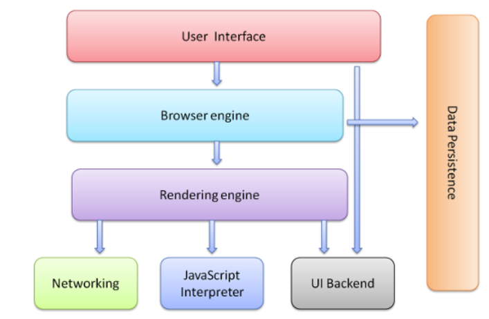
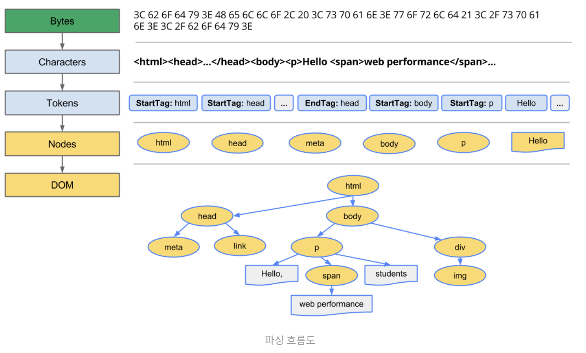

# 브라우저 동작 과정

1. HTML으로부터 DOM 트리를 빌드함 & CSS로부터 CSSOM 트리를 빌드함
2. DOM과 CSSOM을 결합하여 렌더 트리를 형성함
3. 렌더 트리에서 레이아웃을 실행하여 각 노드의 기하학적 형태를 계산함
4. 개별 노드를 화면에 paint

<br>

## 브라우저 구성 요소

- 브라우저는 다양한 레이어들로 구성되며 이들은 여러 관계를 맺고 있다



### 1️⃣ 사용자 인터페이스

- 브라우저상에서 볼 수 있는 대부분의 요소로, 요청한 페이지를 보여주는 창 이외의 모든 UI를 뜻함
- UI 예시
  - 주소창
  - 뒤로가기
  - 새로고침
  - 북마크
  - 환경설정 등

### 2️⃣ 브라우저 엔진

- UI와 렌더링 엔진 사이에서 중개자 역할을 수행
- UI레이어의 새로고침 버튼을 눌렀을 경우, 브라우저 엔진은 이를 이해하고 새로고침 명령을 수행함

### 3️⃣ 렌더링 엔진

- HTML과 CSS, JavaScript를 파싱하고 그 결과물을 바탕으로 페이지를 그려내는 역할을 수행함
- 브라우저 별 엔진 구성
  - Chrom, Opera, Edge => Blink
  - Firefox => Gecko
  - Internet Explorer => Trident
  - Safari => Webkt

### 4️⃣ 네트워크 레이어

- HTTP나 HTTPS 같은 프로토콜을 이용해서 외부의 리소스를 얻어오고, 서버에 요청을 보낼 때 사용되는 레이어

### 5️⃣ JavaScript 인터프리터

- JavaScript를 해석하고 실행하는 역할을 수행함
- ex) Chrome의 V8엔진

### 6️⃣ UI 백엔드

- 브라우저가 동작하고 있는 OS의 인터페이스를 따르는 UI를 처리함
- ex) alert나 select box등은 OS별로 다르게 동작함

### 7️⃣ 자료 저장소

- 브라우저 자체에서 하드디스크와 같이 데이터를 로컬에 저장하기 위한 레이어
- 쿠키나 로컬 스토리지, 세션 스토리지, IndexedDB, Web SQL, 파일시스템 등에 접근하고 데이터를 저장하는데 사용됨

<br>

## 렌더링 엔진의 동작 과정

- 네트워크를 통해 얻어온 HTML과 CSS를 해석하는 것을 시작으로 본격적인 렌더링 작업이 시작된다


사용자가 특정 웹 페이지에 접속하면 네트워크를 통해 해당 웹 페이지의 HTML 문서를 얻어오게 된다.<br>
이후 렌더링 엔진은 위 과정을 거쳐서 읽어들인 HTML 문서를 해석한다<br>

<br>

## 중요 렌더링 경로 (Critical Rendering Path)

- 각 단계에서 리소스를 로드하는 순서나 작성한 스크립트의 내용에 따라 웹 페이지의 반응 속도가 달라질 수 있음 <br>
- 또한 이러한 과정의 최적화를 통해 프론트엔드 개발자는 렌더링에 걸리는 시간을 개선시킬 수 있음

- 중요 렌더링 경로의 각 단계는 다음과 같다.

<br>

### 1️⃣ 파싱

- `토큰화된 코드를 구조화하는 과정`

- `파서(Parser)`: 파싱 과정을 전문적으로 해주는 부분
- `토큰화`: 의미있는 최소 단위로 코드를 쪼개는 것

<br>

### 2️⃣ HTML 파싱



- 브라우저는 토큰화된 HTML의 문자열을 이용해서 `Parse Tree`를 생성함
- `파스 트리(Parse Tree)`: 브라우저가 읽어야 할 HTML 코드를 트리 모양으로 구조화해서 나타낸 것

- 브라우저는 파스 트리를 이용해서 `DOM(Document Object Model) 트리`를 새로 만들기 때문에 파스 트리를 이용해서 바로 렌더를 할 수는 없음

<br>

#### Parse Tree vs DOM tree

| Parse Tree                               | DOM tree                                                                                                               |
| :--------------------------------------- | :--------------------------------------------------------------------------------------------------------------------- |
| 토큰화된 문자열을 단순하게 구조화한 트리 | 우리가 실제로 상호작용할 수 있는 HTML element로 이루어진 트리<br> 개발자가 실제로 JavaScript로 상호작용할 수 있는 부분 |

<br>

#### HTML 파서의 특징

##### 1️⃣ 오류에 너그럽다 (forgiving nature)

- HTML을 파싱하는 도중에 어떠한 에러가 발생하면 브라우저는 자체적으로 에러를 복구하려 함

```html
<!-- 잘못 작성된 코드 -->
<body>
  <p class="highlight">Hello</p>
  <div><span>World</span></div>
</body>
```

```html
<!-- html 코드를 브라우저에서 실행해서 얻어낸 완성 코드 -->
<body>
  <p class="highlight">Hello</p>
  <div><span>World</span></div>
</body>
```

<br>

##### 2️⃣ 파싱 과정이 중단될 수 있음

- HTML파서는 파싱 도중 `<script>`, `<link>`등의 외부 태그를 만나게 되면 HTML 파싱을 즉시 중단하고 해당 태그의 해석을 실행함
  <br> (만약 해당 태그가 외부 파일을 참조하고 있다면 다운로드를 한 다음에 해석을 시작함)

- 왜냐하면 `<script>`에 DOM을 직접적으로 수정할 수 있는 내용이 있을수도 있기 때문이다
  <br> (만약, `document.write()`와 같은 API를 사용하면 HTML을 파싱하고 있는 도중에도 DOM 엘리먼트를 동적으로 삽입할 수 있음) - 이로 인해 외부 컨텐츠를 해석하고 실행할때까지 HTML의 파싱은 중단됨

<br>

##### 3️⃣ 재시작(Reentrant)

- HTML의 파싱 과정은 파싱 중간에 외부 요인으로 인해 DOM이 추가되거나 변경 및 삭제될 수 있음
- 이러한 경우에는 HTML은 처음부터 파싱 과정을 거침
  <br> (즉, 바이트를 문자로 변환하고, 토큰을 식별한 후 노드로 변환하고 DOM 트리를 빌드함)
  <br> 이 때문에 처리해야할 HTML이 많을 경우에는 파싱 시간이 오래걸릴 수 있음

<br>

### 3️⃣ CSS 파싱

- 일반적으로 CSS를 링크하는 코드가 HTML 코드 내에 삽입되어 있으므로 HTML을 파싱하는 도중에 CSS 파싱이 시작됨

- 네트워크를 통해 먼저 받아온 코드부터 해석을 실행할 수 있는 HTML 파서와 달리, CSS 파서는 전체 파일을 모두 다운로드할 때까지 파싱을 시작할 수 없음

- 전체 CSS 파일을 다운로드한 다음 CSS 파싱이 끝나면 코드에서 명세한 내용과 순서를 바탕으로 DOM과 같은 트리를 구성하는데 이를 `CSSOM(CSS Object Model)`트리라 부름
  <br> (이 트리에는 스타일, 규칙, 선택자 등의 정보가 노드에 들어가게 됨)

<br>

### 4️⃣ 렌더 트리

- `화면에 나타나는 요소들을 결정하는 트리`
  - 어떠한 요소들이 보여야 하는지, 어떤 스타일이 적용되어야 하는지, 어떤 순서로 나타낼 것인지를 명세하는 트리

<br>

- DOM 트리가 구성되는 동안 브라우저는 `렌더 트리(Render Tree) [= 프레임 트리]`를 구성하기 시작함

- `DOM + CSSOM = 렌더 트리`
  - 렌더 트리는 DOM 트리와 CSSOM 트리를 조합하여 만들어지고, 화면에 그려지지 않는 요소들은 트리에 나타나지 않음
  - 가령 `<head>`, `<script>` 등과 같은 태그나 `display: none`스타일이 적용된 요소들이 포함된 태그는 시각적으로 나타낼 것이 없기 때문에 렌더 트리에 그려지지 않음
  - 즉, 렌더 트리는 DOM 트리와 정확하게 1:1로 매칭되지는 않음


<br>

### 5️⃣ 레이아웃 (또는 리플로우)

- 리플로우 단계에서는 `렌더 트리에서 계산되지 않았던 노드들의 크기와 위치, 레이어 간 순서와 같은 정보를 계산하여 좌표에 나타냄`
  <br> (이 과정은 HTML의 root object로부터 재귀적으로 실행이 됨)

- 레이아웃은 계산의 범위에 따라 `전역적 레이아웃(Global Layout)`과 `증분적 레이아웃(Incremental Layout)`으로 구분할 수 있음

#### 전역적 레이아웃

- 화면 전체의 레이아웃을 계산하는 것

  - ex) 새로운 폰트 적용, 폰트 사이즈가 바뀌거나 뷰포트의 사이즈 변경 같은 경우 전체 레이아웃을 다시 계산함

- 전역적 레이아웃 단계는 모든 렌더 트리 노드에 대한 기하학적인 계산을 수행하므로 노드가 많아지게되면 속도가 느려짐
  <br> (따라서 브라우저에서는 자체적인 최적화 로직을 탑재하고 있음)

##### 최적화 로직 시스템 - 더티 비트 시스템

- 더티 비트 시스템(Dirty bit System)
  - 특정 Element의 layout이 변경되었을 때, 렌더 트리를 처음부터 탐색하면서 레이아웃을 계산하지 않고 특정한 부분만 다시 계산하여 리소스의 낭비를 줄이는 최적화 방법

#### 증분적 레이아웃

- 더티 비트 시스템을 활용하여 레이아웃 과정에서 렌더 트리를 재귀적으로 탐색을 하다가 더티한 element들 (즉, 레이아웃의 변경이 발생해야하는 엘리먼트들을) 만나게 되면 그 계산을 즉시 수행하는 것이 아니라 스케줄러를 통해 비동기로 일괄 작업(batch)을 진행함
  - 이를 통해 연산의 횟수와 범위를 줄일 수 있음

<br>

### 6️⃣ 페인트

- `레이아웃 단계를 통해 화면에 배치된 엘리먼트들에게 색을 입히고 레이어의 위치를 결정하는 단계`

- 전역적 페인팅과 증분적 페인팅이 존재함

- 문서가 클수록 브라우저가 수행해야 하는 작업의 양이 늘어나고, 스타일이 복잡할수록 페인팅에 걸리는 시간도 늘어남
  <br> (ex. 단색은 페인팅시 소요되는 시간과 작업이 적게 필요하지만, 그림자 효과를 적용할 경우 이를 계산하고 페인트하는데 시간과 작업이 더 필요함)

- `z-index`가 낮은 순서대로 먼저 페인팅이 됨
